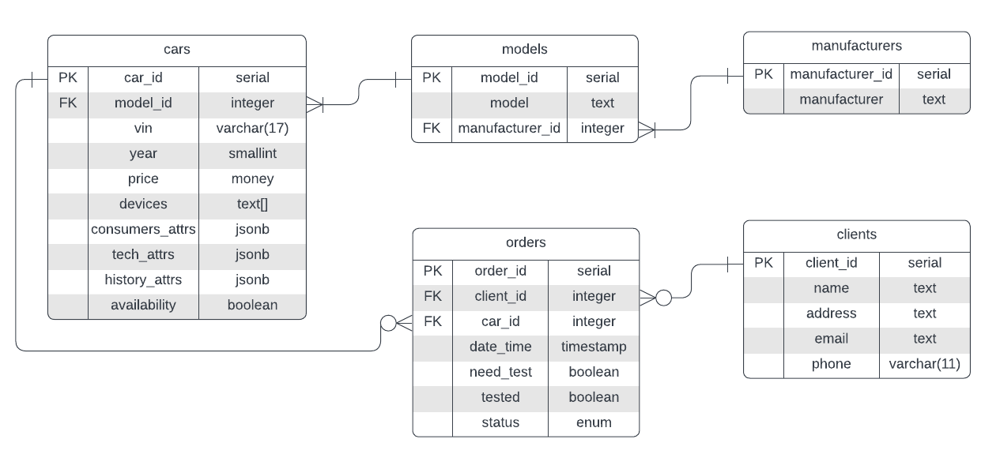

# Информационная система автосалона
Ниже описывается концептуальная модель пользовательского интерфейса приложения: набор страниц и их содержание, схема навигация между страницами, сценарии использования (юзкейсы). Приводится схема и описание базы данных.

## ER-диаграмма базы данных

Комментарии:
* PostgreSQL
* Файлы создания и заполнения БД лежат в src/main/resources/sql/
* Характеристики автомобилей хранятся в jsonb-словарях - это позволяет [без потери в производительности](https://habr.com/ru/post/475178/) использовать как стандартные характеристики, так и добавлять при желании новые для данного автомобиля, не внося изменений в структуру БД. 
* Статусы заказа: "В работе", "Отменён", "Ожидание оплаты", "Оплачен", "Завершён", "На тест-драйве".

## Описание страниц

### **Главная**
* Мини-дэшборд с некоторой статистикой по базе данных, например, количество автомобилей в наличии, в тест-драйве, число активных заказов и т. п.
* Меню, содержащее ссылки на основные страницы сайта: главная, каталог автомобилей, список моделей, список производителей, список клиентов, список заказов. Меню доступно на всех страницах сайта.

### **Автомобили**
#### **Каталог автомобилей**
* По умолчанию выводится список всех автомобилей с пагинацией по страницам. Поле поиска по модели, кнопка "Найти". Поля фильтров, позволяющие задать характеристики автомобиля, кнопка применения фильтров. Кнопки сортировки автомобилей по цене, году выпуска, пробегу.
* В списке в карточке каждого автомобиля приведена краткая информация о нём (производитель, модель, год выпуска, пробег, наличие, цена). По клику на модель можно перейти на страницу модели. По клику на производителя можно перейти на страницу производителя. Кнопка "Удалить", удаляющая автомобиль из БД (каскадно удаляются все нерабочие заказы). Кнопка "Редактировать", переводящая на страницу редактирования автомобиля. Кнопка "Посмотреть", переводяшая на страницу автомобиля.
* Кнопка "Добавить автомобиль", переход на страницу добавления автомобиля.

#### **Добавление автомобиля**
Форма добавления автомобиля с различными полями.
* Производитель. Выпадающий список и кнопка перехода на страницу "Производители", если производителя нет в БД, для добавления.
* Модель. Выпадающий список моделей заданного производителя. Кнопка перехода на страницу "Добавление модели", если модели нет в БД.
* Основные характеристики. Поля: VIN, год выпуска, цена. 
* Технические характеристики. Поля: объем и мощность двигателя, расход топлива, количество дверей, мест, вместимость багажника, тип коробки передач, круиз-контроль, требуемое топливо. Кнопка "Добавить характеристику", добавляющая новую характеристику.
* Потребительские характеристики. Поля: цвет, обивка салона. Кнопка "Добавить характеристику", добавляющая новую характеристику.
* Изменяемые характеристики. Поля: пробег, год последнего ТО. Кнопка "Добавить характеристику", добавляющая новую характеристику.
* Внутренние устройства. Кнопка "Добавить устройство", добавляющая новое поле.

Кнопка "Добавить автомобиль".

#### **Страница автомобиля**
* Информация об автомобиле (характеристики, кликабельные ссылки на клиентов, бравших тест-драйв). По клику на производителя переход на страницу производителя, по клику на модель - на страницу модели.
* Кнопка "Редактировать", переводящая на страницу редактирования автомобиля. 
* Кнопка "Удалить", удаляющая автомобиль из БД (каскадно удаляются все нерабочие заказы).

#### **Редактирование автомобиля**
Форма редактирования автомобиля с различными полями. Аналогично добавлению. Также можно отредактировать поле "Наличие" (В наличиии или нет).

### **Модели**
#### **Список моделей**
* По умолчанию выводится список всех моделей. Поле поиска по модели, кнопка "Найти". Поле фильтра по производителю, кнопка применения фильтра.
* В списке в карточке каждой модели приведена краткая информация о ней (производитель, название модели). По клику на производителя можно перейти на страницу производителя. Кнопка "Удалить", удаляющая модель из БД (при наличии автомобилей запрещается). Кнопка "Редактировать", переводящая на страницу редактирования модели. Кнопка "Посмотреть", переводяшая на страницу модели.
* Кнопка "Добавить модель", переход на страницу добавления модели.

#### **Добавление модели**
Форма добавления модели. Поля:
* Производитель. Выпадающий список и кнопка перехода на страницу "Производители", если производителя нет в БД, для добавления.
* Название модели.

#### **Страница модели**
* Информация о модели. По клику на производителя переход на страницу производителя. Список автомобилей данной модели.
* Кнопка "Редактировать", переводящая на страницу редактирования модели. 
* Кнопка "Удалить", удаляющая модель из БД (при наличии автомобилей запрещается).

#### **Редактирование модели**
Форма редактирования модели (название, производитель). Аналогично добавлению.

### **Производители**
#### **Список производителей**
* По умолчанию выводится список всех производителей. Поле поиска, кнопка "Найти".
* Кнопка "Удалить" (при наличии моделей запрещается). Поле редактирования имени производителя. Кнопка "Посмотреть", переводяшая на страницу производителя.
* Поле и кнопка "Добавить производителя".

#### **Страница производителя**
* Название производителя. Список моделей данного производителя.
* Поле редактирования имени производителя.
* Кнопка "Удалить", удаляющая производителя из БД (при наличии моделей запрещается).

### **Клиенты**
#### **Список клиентов**
* По умолчанию выводится список всех клиентов с пагинацией по страницам. Поле поиска по ФИО, кнопка "Найти". Поля фильтров, позволяющие задать атрибуты заказов, кнопка применения фильтров.
* В списке в карточке каждого клиента приведена краткая информация о нём (ФИО, телефон, email). Кнопка "Удалить", удаляющая клиента из БД (каскадно все его нерабочие заказы). Кнопка "Редактировать", переводящая на страницу редактирования клиента. Кнопка "Посмотреть", переводяшая на страницу клиента.
* Кнопка "Добавить клиента", переход на страницу добавления клиента.

#### **Добавление клиента**
Форма добавления клиента с различными полями.
* ФИО
* Адрес
* Телефон
* Email

Кнопка "Добавить клиента".

#### **Страница клиента**
* Информация о клиенте (id, ФИО, адрес, телефон, email).
* Список заказов клиента.
* Кнопка "Редактировать", переводящая на страницу редактирования клиента. 
* Кнопка "Удалить", удаляющая клиента из БД (каскадно все его нерабочие заказы).

#### **Редактирование клиента**
Форма редактирования клиента с различными полями. Аналогично добавлению.

### **Заказы**
#### **Список заказов**
* По умолчанию выводится список всех заказов с пагинацией по страницам. Поле поиска по id заказа, кнопка "Найти". Поля фильтров, позволяющие задать атрибуты заказов, кнопка применения фильтров.
* В списке в карточке каждого заказа приведена информация о нём (ID, ФИО клиента - кликабельно, производитель + модель автомобиля - кликабельно, дата и время создания, статус). Кнопка "Редактировать", переводящая на страницу редактирования заказа. Кнопка "Посмотреть", переводяшая на страницу заказа.
* Кнопка "Создать заказ", переход на страницу создания заказа.

#### **Создание заказа**
Форма создания заказа с различными полями.
* VIN автомобиля. Autocomplete поле. "VIN + производитель + модель".
* ФИО клиента. Autocomplete поле. "ID + ФИО".
* Статус заказа. Выпадающий список статусов - по умолчанию доступны для выбора "В работе", "Отменён", "Ожидание оплаты", "Оплачен", "Завершён". Если в таблице есть другой заказ с таким автомобилем и статусом "На тест-драйве", то такой статус недоступен для выбора и выводится сообщение, что автомобиль в данный момент занят. Иначе выставление статуса "На тест-драйве" доступно. При выставлении статуса "На тест-драйве" поле-флаг tested ("Был в тест-драйве") устанавливается в True - это сохраняет информацию, что автомобиль в ходе заказа тестировался клиентом.
* Дата и время заполняются автоматически при создании заказа.

Кнопка "Создать заказ".

#### **Страница заказа**
* Информация о заказе (информация об автомобиле, клиенте, заказе).
* Кнопка "Редактировать", переводящая на страницу редактирования заказа. 

#### **Редактирование заказа**
Форма редактирования заказа с различными полями. Аналогично созданию.

## Сценарии использования
### **Автомобили**
#### **Получение списка автомобилей по разным характеристикам**
Главная -> каталог автомобилей
#### **Добавить автомобиль**
Каталог автомобилей -> кнопка "Добавить автомобиль"
#### **Посмотреть страницу автомобиля**
* Каталог автомобилей -> выбрать автомобиль в списке -> кнопка "Посмотреть"
* Список автомобилей на странице модели -> выбрать автомобиль в списке -> кнопка "Посмотреть"
#### **Редактировать автомобиль**
* Страница автомобиля -> кнопка "Редактировать"
* Аналогично пунктам в "Посмотреть страницу автомобиля", но кнопка "Редактировать"
#### **Удалить автомобиль**
Аналогично "Редактировать автомобиль", но кнопка "Удалить"

### **Модели**
#### **Получение списка моделей по разным характеристикам**
Главная -> список моделей
#### **Добавить модель**
Список моделей -> кнопка "Добавить модель"
#### **Посмотреть страницу модели**
* Список моделей -> выбрать модель в списке -> кнопка "Посмотреть"
* Список моделей на странице производителя -> выбрать модель в списке -> кнопка "Посмотреть"
#### **Редактировать модель**
* Страница модели -> кнопка "Редактировать"
* Аналогично пунктам в "Посмотреть страницу модели", но кнопка "Редактировать"
#### **Удалить модель**
Аналогично "Редактировать модель", но кнопка "Удалить"

### **Производители**
#### **Получение списка производителей**
Главная -> список производителей
#### **Добавить производителей**
Список производителей -> поле и кнопка "Добавить производителя"
#### **Посмотреть страницу производителя**
* Список производителей -> выбрать производителя в списке -> кнопка "Посмотреть"
#### **Редактировать производителя**
* Страница производителя -> поле редактирования
* Список производителей -> выбрать производителя в списке -> поле редактирования
#### **Удалить производителя**
Аналогично "Редактировать производителя", но кнопка "Удалить"

### **Клиенты**
#### **Получение списка клиентов по характеристикам заказов**
Главная -> список клиентов
#### **Добавить клиента**
Список клиентов -> кнопка "Добавить клиента"
#### **Посмотреть страницу клиента**
Список клиентов -> выбрать клиента в списке -> кнопка "Посмотреть"
#### **Редактировать клиента**
* Страница клиента -> кнопка "Редактировать"
* Аналогично "Посмотреть страницу клиента", но кнопка "Редактировать"
#### **Удалить клиента**
Аналогично "Редактировать клиента", но кнопка "Удалить"

### **Заказы**
#### **Получение списка заказов по характеристикам**
Главная -> список заказов
#### **Создать заказ**
Список заказов -> кнопка "Создать заказ"
#### **Посмотреть страницу заказа**
* Список заказов -> выбрать заказ в списке -> кнопка "Посмотреть"
* Страница клиента -> Список его заказов -> выбрать заказ в списке -> кнопка "Посмотреть"
#### **Редактировать заказ**
* Страница заказа -> кнопка "Редактировать"
* Аналогично "Посмотреть страницу заказа", но кнопка "Редактировать"

### **Тест-драйвы**
#### **Информация о тест-драйве в рамках заказа**
Страница заказа -> возможен статус "На тест-драйве",  булево поле "Был на тест-драйве".
#### **Тест-драйвы клиента**
* Страница клиента -> список заказов -> в карточке заказа возможен статус "На тест-драйве"
* Страница клиента -> список заказов -> страница заказа -> возможен статус "На тест-драйве",  булево поле "Был в тест-драйве"
#### **Тест-драйвы автомобиля**
* Страница автомобиля -> список клиентов, бравших автомобиль на тест-драйв; клиент, у которого автомобиль сейчас на тест-драйве
